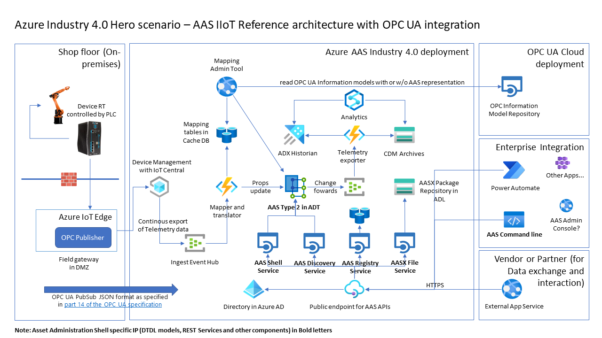

# Open Digital Twins - Asset Administration Shell - Azure services

Sample [Industry 4.0 Asset Administration Shell REST API](https://www.plattform-i40.de/IP/Redaktion/EN/Downloads/Publikation/Details_of_the_Asset_Administration_Shell_Part2_V1.html) implementations for AAS Type 2 on [Azure Digital Twins](https://azure.microsoft.com/en-us/services/digital-twins/) using the [Open Digital Twins Asset Administration Shell ontology](https://github.com/JMayrbaeurl/opendigitaltwins-assetadminstrationshell)

The following Asset Administration Shell API implementations are are provided:

- **AASX File server**: See 'aas-api-webapp-aasxfile' folder in 'src'. Implements the 
[AASX File Server Interface](https://app.swaggerhub.com/apis/Plattform_i40/AssetAdministrationShell-REST-API/Final-Draft#/AASX%20File%20Server%20Interface/GetAllAASXPackageIds) 
using [Azure Blob Storage](https://azure.microsoft.com/en-us/services/storage/blobs/). By default all AASX package files are stored as blobs 
in a container called `aasxfiles`. The name of the container to be used can be configured. If the container doesn't exist in the Blob storage account, 
it will be created automatically. For each package a folder with the file name without the file extension will be created in the container. 
Samples from [AASX Browser](https://admin-shell-io.com/5001/) were used for testing.
- **AAS Discovery server**: See 'aas-api-webapp-discovery' folder in 'src'. Partially implemented.
- **AAS Registry server**: See 'aas-api-webapp-registry' folder in 'src'. Partially implemented.
- **AAS Shell Repository server**: See 'aas-api-webapp-repository' folder in 'src'. Partially implemented.
- **AAS Full server**: See 'aas-api-webapp-full' folder in 'src'. Implementation of the entire interface collection as part of 
[Details of the Asset Administration Shell Part 2](https://www.plattform-i40.de/IP/Redaktion/EN/Downloads/Publikation/Details_of_the_Asset_Administration_Shell_Part2_V1.pdf)



## Security
All servers use [Default Azure credentials](https://docs.microsoft.com/en-us/dotnet/api/overview/azure/identity-readme) 
for authorization ([Managed Identities](https://docs.microsoft.com/en-us/azure/active-directory/managed-identities-azure-resources/overview)) 
and must have according entries in the RBAC lists of the used Azure services (Azure Digital Twins and Azure Blob storage).

## Build and Run

Linux/OS X:

```
sh build.sh
```

Windows:

```
build.bat
```

## AASX File server
TBD.

The REST API operation `PostAASXPackage`of the AASX File Server Interface has some additional capabilities. 
If a valid download link (URL) to an AASX package file is provided in the parameter `fileName` and the parameter `file` is null, than the 
server will download the file directly to the storage. 

### Configuration
- Azure Blob storage configuration: Use `AASX_FILESERVICE_BLOBSTORAGEURL` in Application Settings to configure the url of the target
storage. E.g. `https://aasxstoragejm.blob.core.windows.net/`. By default a container titled `aasxfiles` will be used to store the aasx
packages. This can be changed by specifying another value in the Application settings for `AASX_FILESERVICE_CONTAINERNAME`. 
- Security: Beside the generic security setup (Azure AD App registration) the role `Storage Blob Data Contributor` has to be assigned 
to the AASX File server. E.g. by leveraging its Managed Identity of the App service.

## AAS Discovery server
TBD

## AAS Registry server
TBD

## AAS Shell Repository server
The AAS Shell Repository server offers a RESTful api to create, read, update or delete Asset Administration Shells or Submodels.


### Scope
The AAS metamodel is based on the Specification in "Details of the Asset Administration Shell Part 1" Version 3.0RC02. The implementation of the api is based on "Details of the Asset Administration Shell Part 2" Version 1.0RC02. Currently the only supported submodel elements are
- Property
- File
- Submodel Element Collection

In terms of the api it is currently not supported to do partial updates on submodels like adding  or changing an existing a submodel element. Only full updates can be performed on an AAS or submodel.

You can view the implemented endpoints via the swagger ui: ```https://<your-server-url>/api/swagger```

### Deployment
The AAS Shell Repository can be deployed on Windows via Powershell. Preconditions are a Microsoft Azure Subscription, the Docker Runtime and the Azure CLI installed. 
```
.\scripts\arm-bicep-azuredeployment\deployAasRepository.ps1
```

The Azure Digital Twins Instance will be deployt together with an Azure Container App that will host the Docker container with the AAS Repository API.

Per default the Script will deploy into a ressource group named "rg-test-aasrepo" in the location "West Europe". This can be overwritten with the following parameters for the deployment Script
```
.\scripts\arm-bicep-azuredeployment\deployAasRepository.ps1 -rg "<ressource-group-name>" -dcloc "<location>"
```
The Azure Container App Instance is created with a system managed identity. This managed identity is granted the role as "Digital Twins Data Owner" for the whole resource group which means it can read data from / write data to the Azure Digital Twins Instance.

After the deployment of the ressources it is neccessary to upload all the DTDL-Models to the Azure Digital Twins instance to prepare it for the creation of real twins. The models are part of the ontology that can be cloned from GitHub. Just upload the "Ontology" folder to the Azure Digital Twins models.
```
git clone https://github.com/JMayrbaeurl/opendigitaltwins-assetadminstrationshell.git
```

### Security
The api will be accepting all requests and has no security implemented by default. These settings can be adjusted in the File ```src/aas-api-webapp-repository/Startup.cs```. 

However if you use the deployment script then the Container Instance will enable the Ingress controller but restrict the access to your public IP Address. This should provide a sufficent security for testing purposes. The settings can also be changed afterwards in the Ingress settings tab inside of the Azure Container App Instance.

## AAS Full server
TBD
